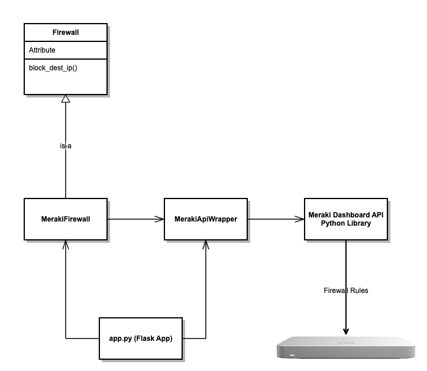

# Background
Developed as a proof of concept of an integration between Cisco Stealthwatch Enterprise and Meraki MX. 

This component, when integrated through the "External Lookup" feature of Cisco Stealthwatch Enterprise enables
the user to instruct the Meraki MX firewall to block an outside IP address from within Stealthwatch.

Underneath the covers, it uses the [Meraki API](https://github.com/meraki/dashboard-api-python).

# Structure

The code is the best source of truth. However, here is a UML model that illustrates at a high-level how the code is structured.



# How to run unit tests

Deployment is based on Docker and containerization - however, development and unit testing is not. For development, we use Python's Virtual Environment feature. You can set this up by running this script:
```
./createvenv.sh
```

Now, we can run the unit tests as follows:

```
./unittest.sh

# How to build and run

You will need to modify the Dockerfile and put in your details:
```
ENV api_key YOUR_MERAKI_API_KEY_GOES_HERE
ENV network_id YOUR_MERAKI_NETWORK_ID_KEY_GOES_HERE
ENV src_cidr YOUR_LOCAL_SRC_CIDR_GOES_HER
```
Then, build your Docker image as follows:
```
./build.sh
```
Decide which port you want the service to listen on - default is 5002. Modify the run.sh script if you want 
to use a different port and map it to the container port of 5002.

Finally, run as follows:

```
./run.sh
```

You can view the logs as follows:

```
tail -f nohup.out
```

You can test as follows, by pointing your browser to:
```
http://<server>:5002/block/?ipaddress=<ipaddress to block>
```
# Security Warning
Note, that this is un-secure so be careful. You've deployed something that enables firewall rules to be 
added without authentication. If you want to use this in production somewhere, you will either need to 
add some authentication layer and/or deploy it in a tightly controlled environment.


