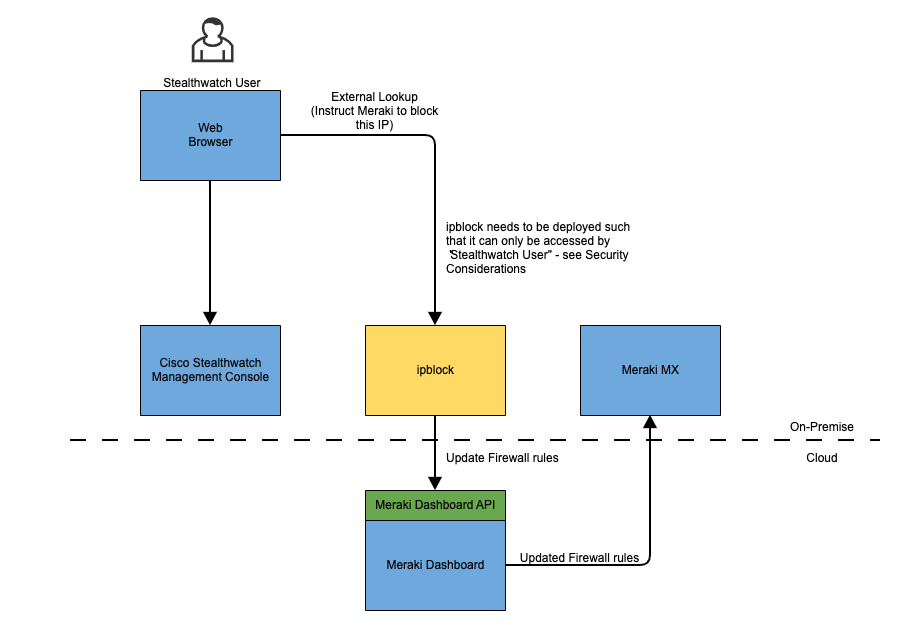
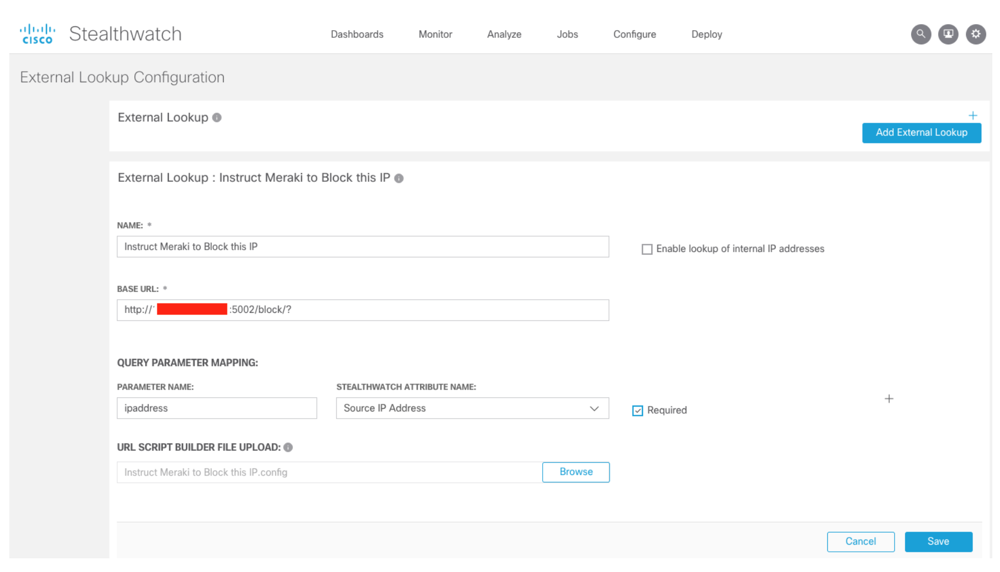
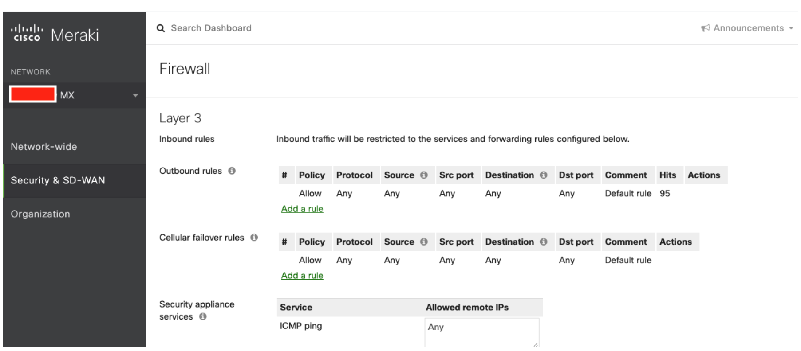
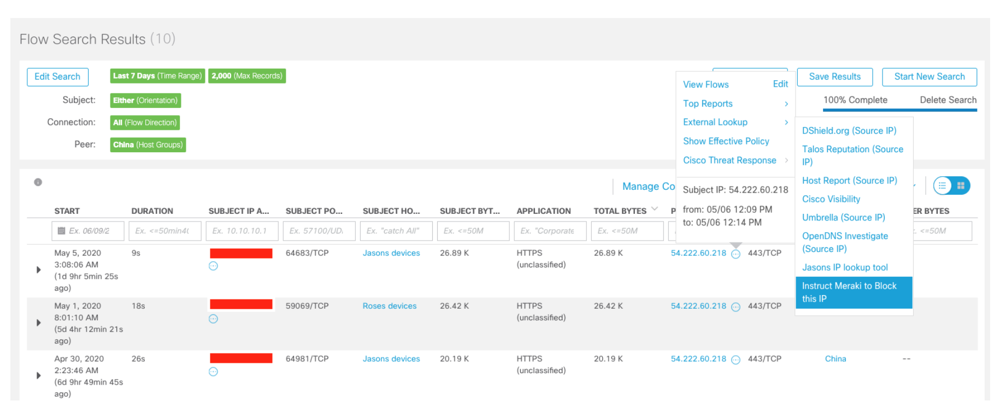
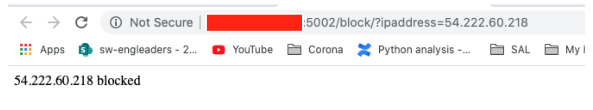
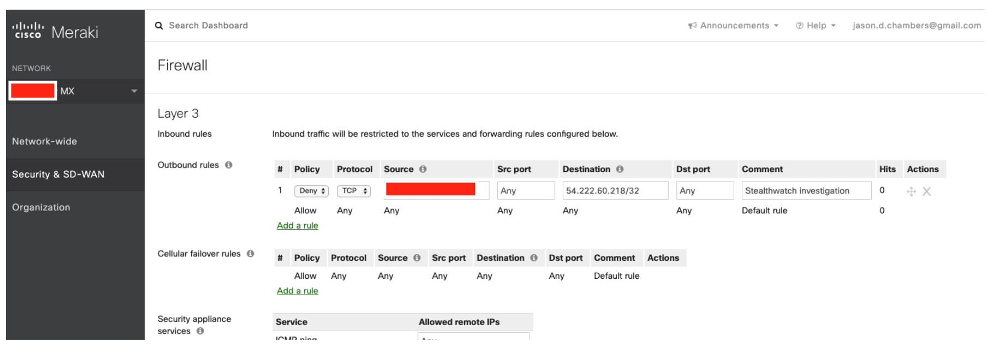
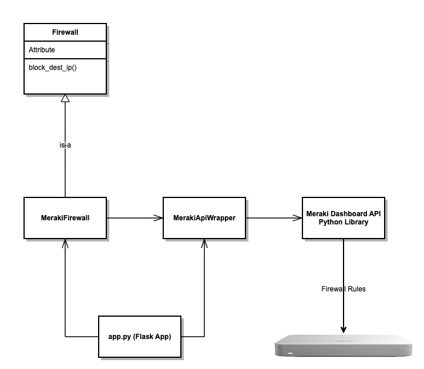

# ipblock

This component, when integrated through the [External Lookup](https://www.cisco.com/c/dam/en/us/td/docs/security/stealthwatch/management_console/external_lookup/SW_7_3_External_Lookup_DV_1_0.pdf) feature of [Cisco Stealthwatch Enterprise](https://www.cisco.com/c/en/us/products/security/stealthwatch/index.html) enables the user to instruct the Meraki MX firewall to block an outside IP address directly from within Cisco Stealthwatch.

It provides value by improving threat response time as it allows the user to quickly block suspicious IP addresses from within the Cisco Stealthwatch UI without having to log-in and navigate through the Meraki Dashboard UI. 

It is applicable for anyone who is using a combination of Cisco Stealthwatch Enterprise AND Meraki MX. It may also be useful serving as an example of usage of the [Meraki Dashboard API Python Library](https://github.com/meraki/dashboard-api-python).

The various integrated components are connected together as follows:



This component is available for use by the Cisco DevNet community through Code Exchange.


## Requirements
1. Docker (this component is built and run as a Docker container)
2. Cisco Stealthwatch Enterprise 7.1.2 and above
3. Meraki MX (L3 firewall) 
4. A server where the container can run - access to the server should be highly restricted (see Security Warning below)

## Security Warning

This component is provided as a proof-of-concept. It is NOT RECOMMENDED to deploy this component as-is into a production environment without considering security. This component provides a REST endpoint that makes it easy and convenient to write firewall rules. This is a very powerful capability and therefore if not deployed thoughtfully with adequate controls, it could increase exposure to risk. 

This is in contrast to typical applications of the "External Lookup" feature which are idempotent in nature and therefore do not modify any state.

To deploy this capability into production, it is strongly recommended to add an authentication layer and/or deploy it on a server/network environment that is highly restricted.

## Installation
Installation involves configuration, build and run followed by configuration of the External Lookup feature within Cisco Stealthwatch Enterprise.

To get started with the installation, simply clone this project (assuming Git is installed) then move on to the "Configuration" step. 

## Configuration
Modify the `Dockerfile` as guided (these pieces of information can be found logging into the Meraki Dashboard):
```
ENV api_key YOUR_MERAKI_API_KEY_GOES_HERE
ENV network_id YOUR_MERAKI_NETWORK_ID_KEY_GOES_HERE
ENV src_cidr YOUR_LOCAL_SRC_CIDR_GOES_HER
```
> **Note:** To obtain your Meraki API key, please follow these steps: https://documentation.meraki.com/zGeneral_Administration/Other_Topics/The_Cisco_Meraki_Dashboard_API

Decide which port the service is to listen on - the default is 5002. Modify the run.sh script if there is a requirement to use a different port and map it to the container port of 5002.

Now continue to the "Build" step.

## Build and Run
Once configured, build the Docker image as follows:
```
./build.sh
```
Once built, run the Docker container as follows:
```
./run.sh
```

## Cisco Stealthwatch Enterprise Configuration
The next step is configure the External Lookup Feature in Cisco Stealthwatch Enterprise.

Instructions for how to do this can be found in the [Cisco Stealthwatch documentation.](https://www.cisco.com/c/dam/en/us/td/docs/security/stealthwatch/management_console/external_lookup/SW_7_3_External_Lookup_DV_1_0.pdf?cachemode=refresh) 

An example configuration is provided as follows. The masked/red portion of the base URL should be replaced with the server the component is running. If during the Configuration step a port different to the default of 5002 is used, be sure to change that in the base URL too.



## Testing

To test, log in to the Meraki Dashboard and inspect the current Layer 3 Outbound rules. By default, these are most likely set to allow any outbound traffic.

For example:


From within Cisco Stealthwatch Enterprise, conduct a Flow Search. From the Flow Search Results, it should now be possible to instruct the Meraki firewall to block an outside IP address as follows (for your particular test, make sure you blocking an IP address that is not going to cause any disruption):


This verifies the target IP address is now blocked.



Refresh the Meraki Dashboard and the new rule should have appeared.



If the test did not work, please review the Debugging section below.

## Debugging
The logs can be viewed as follows:
```
tail -f nohup.out
```
The component can be tested quickly by pointing your browser to:
```
http://<server>:5002/block/?ipaddress=<ipaddress to block>
```
Then, if you log-in to the Meraki dashboard you should see that the L3 firewall rule has been written.

## Developing
This step is optional and is for those who wish to modify the code to suit their specific needs. Please review the "Getting Involved" section below"

Deployment is based on Docker and containerization - however, development and unit testing is not. For development, we use Python's Virtual Environment feature. You can set this up by running this script: 
```
./createvenv.sh
```

Now, we can run the unit tests as follows:

```
./unittest.sh
```

### Structure
The code is the best source of truth. However, here is a UML model that illustrates at a high-level how the code is structured.



## Getting Involved
Contributions to this code are welcome and appreciated... see [CONTRIBUTING](CONTRIBUTING.md) for details... 

Please adhere to our [Code of Conduct](CODE_OF_CONDUCT.md) at all times

## Licensing info
This code is licensed under the BSD 3-Clause License... see [LICENSE](LICENSE) for details
